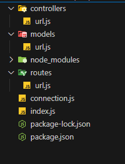
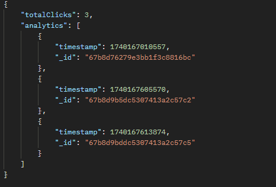

# 🔗 URL Shortener – Built with Node.js, Express, and MongoDB  

## 🚀 Overview  
This is a simple **URL Shortener** built using **Node.js, Express, and MongoDB**. It allows users to create short URLs, use them for redirection, and track analytics like click count and timestamps.  

---

## 🔥 Features  
✅ Create a short URL from any long URL  
✅ Redirect users using the short URL  
✅ Track analytics (click count, timestamps)  
✅ Designed using the **MVC pattern** for better scalability  

---

## 📸 Screenshots  
### 📂 Project Structure  


### 🖥️ Analytics Preview  



---

## Contributing

Contributions are welcome! If you have any suggestions, bug reports, or improvements, feel free to open an issue or submit a pull request.

1. **Fork the repository.**
2. **Create a new branch:**
    ```bash
    git checkout -b feature/your-feature-name
    ```
3. **Make your changes and commit them:**
    ```bash
    git commit -m 'Add some feature'
    ```
4. **Push to the branch:**
    ```bash
    git push origin feature/your-feature-name
    ```
5. **Open a pull request.**

---

## License

This is licensed under the [MIT License](https://choosealicense.com/licenses/mit/), allowing for open collaboration and innovation in the spirit of shared knowledge.

---

## Contact

If you have any questions or feedback, feel free to reach out:

- **Email:** nilawaranimesh@gmail.com

---

## 🔗 Links

[](https://www.linkedin.com/in/animesh-nilawar/)
